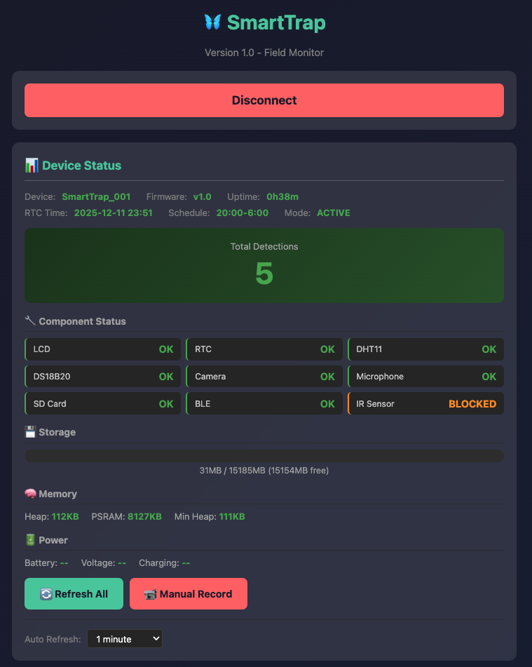

# SmartTrap v1.0

**Low-Power IoT Moth Trap Counter for Fall Armyworm Monitoring**

An automated monitoring system that detects, counts, and logs moth entries into pheromone bucket traps. Designed for sustainable Fall Armyworm (FAW) management in agricultural settings.




---

## Overview

SmartTrap is a low-cost IoT device that automates the monitoring of Fall Armyworm moth populations. It uses infrared beam-break detection to count moths entering pheromone traps, records video/audio evidence, logs environmental conditions, and enables wireless data transfer via Bluetooth Low Energy (BLE).

### Key Applications
- Fall Armyworm population monitoring
- Agricultural research and pest management
- Integrated Pest Management (IPM) decision support
- Scalable deployment across multiple field sites

---

## Features

### Core Functionality
- **IR Beam-Break Detection** - Accurate moth counting with debounce filtering
- **Video Recording** - 10-second AVI clips (MJPEG, 15 FPS) on each detection
- **Audio Recording** - Simultaneous WAV audio capture via onboard microphone
- **Environmental Logging** - Air temperature, humidity, soil temperature, soil moisture
- **Dual CSV Logging** - Separate files for environmental data and detection events
- **SD Card Storage** - Local data storage with organized folder structure

### Connectivity
- **USB Mass Storage** - Press button at system boot up for easy data offload (plug in, wait 10s, copy files)
- **Bluetooth Low Energy (BLE)** - Wireless data transfer and device control
- **Web Client Interface** - Browser-based monitoring dashboard (Chrome)
- **Password Protection** - Secure access to files and device reset

### Power Management
- **Scheduled Sleep Mode** - Configurable active hours (default: 8 PM - 6 AM)
- **Deep Sleep** - Ultra-low power consumption (~14µA) during inactive periods
- **Button Wake** - Manual wake from sleep via hardware button
- **Battery Support** - 3.7V LiPo battery or Power Bank (20,0000 mAh) with USB charging

### Monitoring Dashboard
- **Real-time Status** - Device info, uptime, schedule, detection count
- **Component Health** - Status of all 9 hardware components
- **Storage Monitor** - Visual SD card usage with color-coded warnings
- **Memory Info** - Heap and PSRAM monitoring
- **Auto-Refresh** - Configurable intervals (10s to 30min)

---

## Hardware Requirements

### Main Components

| Component | Model | Purpose |
|-----------|-------|---------|
| Microcontroller | XIAO ESP32S3 Sense | Processing, camera, microphone, SD card |
| Display | DFR0063 16x2 I2C LCD | Status display |
| Real-Time Clock | DS3231 | Accurate timestamps |
| Air Sensor | DHT11 | Temperature and humidity |
| Soil Sensor | DS18B20 | Soil temperature probe |
| Soil Moisture | Capacitive sensor | Soil moisture level |
| IR Emitter | 940nm LED | Beam-break transmitter |
| IR Receiver | 38kHz module | Beam-break receiver |
| Button | 4-pin tactile switch | User input |


### Resistors Required (4 total)

| Value | Color Code | Purpose | Connection |
|-------|------------|---------|------------|
| 100Ω | Brown-Black-Brown | IR LED current limit | D6 → IR LED → GND |
| 4.7kΩ | Yellow-Violet-Red | DS18B20 pull-up | D1 ↔ 3.3V |
| 10kΩ | Brown-Black-Orange | IR receiver pull-down | D7 → GND |
| 10kΩ | Brown-Black-Orange | Button pull-up | D3 → 3.3V |

### Pin Configuration

```
D0 (GPIO1)  → Soil Moisture (Analog)
D1 (GPIO2)  → DS18B20 DATA + 4.7kΩ pull-up to 3.3V
D2 (GPIO3)  → DHT11 DATA
D3 (GPIO4)  → Button → GND + 10kΩ pull-up to 3.3V
D4 (GPIO5)  → I2C SDA (LCD + RTC)
D5 (GPIO6)  → I2C SCL (LCD + RTC)
D6 (GPIO43) → IR LED via 100Ω
D7 (GPIO44) → IR Receiver + 10kΩ pull-down to GND
D8-D10      → RESERVED (SD Card - do not use)
```

---

## Software Requirements

### Arduino IDE Setup

1. **Install Arduino IDE 2.0+** from [arduino.cc](https://www.arduino.cc/en/software)

2. **Add ESP32 Board Package**
   - Go to `File → Preferences`
   - Add to "Additional Boards Manager URLs":
     ```
     https://raw.githubusercontent.com/espressif/arduino-esp32/gh-pages/package_esp32_index.json
     ```
   - Go to `Tools → Board → Boards Manager`
   - Search "esp32" and install (version 2.0.8 or higher)

3. **Select Board Settings**
   - Board: `ESP32S3 Dev Module`
   - USB CDC On Boot: `Enabled` ⚠️ Required for Serial output
   - PSRAM: `OPI PSRAM`
   - Port: Select your device port

### Required Libraries

Install via `Sketch → Include Library → Manage Libraries`:

- `LiquidCrystal I2C` - LCD display
- `RTClib` - DS3231 real-time clock
- `DHT sensor library` - DHT11 sensor
- `OneWire` - DS18B20 communication
- `DallasTemperature` - DS18B20 temperature

---

## Installation

1. **Clone the repository**
   ```bash
   git clone https://github.com/Team-Insect-Net/SmartTrap.git
   cd SmartTrap
   ```

2. **Open the firmware**
   - Open `SmartTrap.ino` in Arduino IDE

3. **Configure settings** (optional)
   ```cpp
   #define DEVICE_NAME         "SmartTrap_001"    // Unique device ID
   #define AUTH_PASSWORD       "smart2025"        // BLE access password
   #define ACTIVE_START_HOUR   20                 // Start monitoring (8 PM)
   #define ACTIVE_END_HOUR     6                  // Stop monitoring (6 AM)
   #define ENV_LOG_INTERVAL_MS 60000              // Log environment every 1 min
   ```

4. **Upload to device**
   - Connect XIAO ESP32S3 Sense via USB-C
   - Select correct port in Arduino IDE
   - Click Upload

5. **Verify installation**
   - Open Serial Monitor (115200 baud)
   - Check all components show "OK"

---

## Usage

### USB Modes at Startup

When you plug in the device, you have 10 seconds to choose:

| Action | Result | Use For |
|--------|--------|---------|
| **Do nothing** (default) | Normal Mode | Field monitoring, firmware updates |
| **Press BUTTON** | USB Drive Mode | Data transfer (SD card as USB drive) |

**Normal Mode (Default)** - Device starts monitoring automatically. Perfect for:
- Field deployment with power bank
- Firmware updates via Arduino IDE
- Debugging with Serial Monitor

**USB Drive Mode** (Press button) - SD card appears as USB drive:
1. Plug in USB-C cable
2. Press BUTTON within 10 seconds
3. SD card appears as removable drive
4. Copy your files
5. Eject and unplug

### Web Client (Wireless)

1. Open `SmartTrap_v1.0_Client.html` in **Google Chrome**
2. Click "Connect to Trap"
3. Select your SmartTrap device from the list
4. Enter password when prompted (default: `smart2025`)

### Dashboard Features

- **Device Status** - Firmware version, uptime, RTC time, schedule
- **Detection Counter** - Total moth detections
- **Component Status** - Health check of all hardware
- **Storage** - SD card usage with visual progress bar
- **Sensors** - Live environmental readings
- **Auto-Refresh** - Set interval from 10s to 30min

### Button Controls

| Action | Function |
|--------|----------|
| Press during startup countdown | Enter **USB Drive Mode** (data transfer) |
| Short press (<1s) | Toggle LCD backlight |
| Long press (5s) | Toggle BLE on/off |
| Press during sleep | Wake device |

### Data Files

```
/logs/
  ├── environment.csv    # Periodic environmental readings
  └── detections.csv     # Detection events with conditions

/events/
  └── YYYYMMDD/          # Daily folders
      ├── HHMMSS.avi     # Video recordings
      └── HHMMSS.wav     # Audio recordings
```

---

## Data Format

### environment.csv
```csv
timestamp,air_temp,humidity,soil_temp,soil_moisture
2024-01-15 20:30:00,24.5,65.2,18.3,2450
```

### detections.csv
```csv
timestamp,detection_num,air_temp,humidity,soil_temp,soil_moisture,video_file,audio_file
2024-01-15 21:45:32,1,23.8,68.1,17.9,2380,/events/20240115/214532.avi,/events/20240115/214532.wav
```

---

## Power Consumption

| Mode | Current | Duration (3000mAh) |
|------|---------|-------------------|
| Active monitoring | ~100-120mA | ~25-30 hours |
| Recording | ~300mA | - |
| Deep sleep | ~14µA | ~24 years |

### Estimated Battery Life

| Battery | Estimated Runtime |
|---------|------------------|
| 3,000mAh | 7-10 days |
| 10,000mAh | 3-4 weeks |
| 20,000mAh | 6-8 weeks |

---

## Documentation

| Document | Description |
|----------|-------------|
| [Hardware Guide](docs/SmartTrap_v1.0_Hardware_Guide.docx) | Wiring diagrams, component list, assembly |
| [Firmware Guide](docs/SmartTrap_v1.0_Firmware_Guide.docx) | Arduino setup, configuration, BLE commands |
| [Field Guide](docs/SmartTrap_v1.0_Field_Guide.docx) | Deployment, maintenance, troubleshooting |
| [Quick Reference](docs/SmartTrap_v1.0_Quick_Reference.docx) | Single-page printable card |

---

## Troubleshooting

| Problem | Solution |
|---------|----------|
| No Serial output | Enable "USB CDC On Boot" in Arduino IDE |
| Upload fails | Hold BOOT → Press RESET → Release → Upload |
| SD card not detected | Use FAT32 format, ≤32GB card |
| DS18B20 reads -999 | Check 4.7kΩ pull-up resistor |
| False button wakes | Add 10kΩ pull-up resistor to button |
| BLE not visible | Long press button (5s) to enable |
| Need USB Drive Mode | Press BUTTON during 10-second countdown |
| Device not monitoring | Don't press button at startup (Normal Mode is default) |
| Power bank → no monitoring | This is fixed! Normal Mode is now default |

---

## Contributing

Contributions are welcome! Please feel free to submit a Pull Request.

1. Fork the repository
2. Create your feature branch (`git checkout -b feature/AmazingFeature`)
3. Commit your changes (`git commit -m 'Add some AmazingFeature'`)
4. Push to the branch (`git push origin feature/AmazingFeature`)
5. Open a Pull Request

---

## License

This project is licensed under **Creative Commons Attribution-NonCommercial-ShareAlike 4.0 International (CC BY-NC-SA 4.0)**.

**You can:**
- Use for research and education
- Modify and build upon
- Share with others

**You must:**
- Give attribution (credit the original authors)
- Share modifications under the same license

**You cannot:**
- Use commercially without permission
- Remove attribution

See the [LICENSE](LICENSE) file for details. For commercial licensing, contact Penn State University.

---

## Acknowledgments

- **Penn State University** - Huck Institutes of the Life Sciences
- **CSIR-CRI Ghana** - Crops Research Institute
- **Seeed Studio** - XIAO ESP32S3 platform documentation
- **NSF INSECT NET** - Graduate training program inspiration

---

## Contact

**Project Lead:** Dr. Edward Idun Amoah  
**Institution:** Penn State University  
**Collaboration:** CSIR-CRI Ghana

---

<p align="center">
  <i>Part of the AI-Powered Monitoring and Modeling for Sustainable Fall Armyworm Management project</i>
</p>
