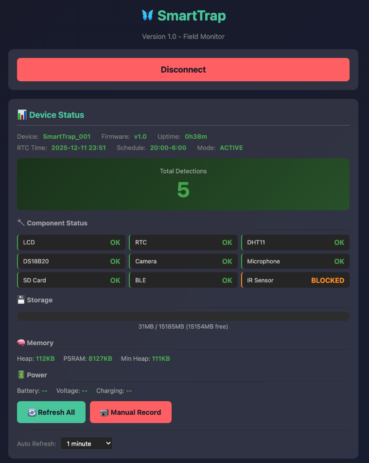

# SmartTrap v2.0

**Low-Power IoT Moth Trap Counter for Fall Armyworm Monitoring**

An automated monitoring system that detects, counts, and photographs moth entries into pheromone bucket traps. Designed for sustainable Fall Armyworm (FAW) management in agricultural settings.




---

## Overview

SmartTrap is a low-cost IoT device that automates the monitoring of Fall Armyworm moth populations. It uses a multi-beam infrared array to count moths entering pheromone traps, captures a JPEG image burst on each detection, and provides all control and data access over Bluetooth Low Energy (BLE) through the **SmartTrap Android app**.

> **v2.0 is a major redesign — BLE-native, button-less, and screen-less.** The phone app replaces the physical button and 16×2 LCD. The environmental sensors (air temperature/humidity, soil temperature, soil moisture) and AVI/WAV recording from v1.x have been removed; detections are now recorded as JPEG bursts. See the [changelog](#whats-new-in-v20).

### 📱 Android App

The SmartTrap Android app is the primary interface for the trap (status, diagnostics, time-setting, file browsing/download, count reset, and WiFi/USB control).

**Download the APK:** <https://drive.google.com/file/d/1rnNRD0PhtQwLzY0d07APNC46B7DXw_hL/view?usp=sharing>

Install by enabling "Install unknown apps" for your browser or file manager, open the downloaded APK, then grant Bluetooth (and Location, if prompted) permissions. Pair with the trap using passkey **`123456`**.

### Key Applications
- Fall Armyworm population monitoring
- Agricultural research and pest management
- Integrated Pest Management (IPM) decision support
- Scalable deployment across multiple field sites

### What's new in v2.0
- **[REMOVED]** Physical button and 16×2 LCD — all interaction is over BLE via the phone app
- **[REMOVED]** Environmental sensors (DHT11, DS18B20, soil moisture) and environmental logging
- **[CHANGED]** Detection recording is now a 10-frame JPEG burst (was AVI video + WAV audio)
- **[CHANGED]** IR detection upgraded to a 4-beam array driven from two pins
- **[NEW]** BLE re-added on the low-RAM NimBLE stack so it can coexist with the camera
- **[NEW]** On-demand WiFi SoftAP + HTTP server for fast bulk image download
- **[NEW]** Set the RTC from the phone app (`SETTIME`) — no re-flash or SetRTC sketch needed for routine time-setting

---

## Features

### Core Functionality
- **4-Beam IR Detection** - Multi-beam beam-break array with debounce filtering
- **JPEG Burst Capture** - 10-frame image burst (1s apart) on each detection
- **Scheduled Daily Photo** - Optional timed reference photo (default 08:00)
- **CSV Logging** - Detection events, beam-health, and daily-photo logs
- **SD Card Storage** - Local data storage with organized folder structure

### Data Management
- **Phone App over BLE** - Status, diagnostics, file browsing/download, and count reset from the Android app
- **On-Demand WiFi Download** - `WIFI:ON` raises a SoftAP + HTTP server for fast bulk image transfer
- **USB Mass Storage** - Mount the SD card as a USB drive via the `USB` BLE command
- **Auto Count Recovery** - Detection count derived from SD card data; survives reboots, resets on data deletion
- **Bonded BLE Security** - Passkey pairing with an encrypted link (legacy plaintext fallback for the old web client)

### Power Management
- **Scheduled Sleep Mode** - Optional configurable active hours (default off; 8 PM - 6 AM when enabled)
- **Deep Sleep** - Ultra-low power consumption during inactive periods
- **RTC-Timer Wake** - Wake from deep sleep on the DS3231 timer
- **Battery Support** - 3.7V LiPo battery or Power Bank (20,000 mAh) with USB charging

### Phone App (BLE)
- **Real-time Status** - Device info, uptime, schedule, detection count (`STATUS`)
- **Component Health** - Camera, mic, SD, RTC, BLE, and IR status (`DIAG`)
- **Memory Info** - Heap and PSRAM monitoring
- **Live Pushes** - `EVENT` on each detection, `BEAM:BLOCKED`/`BEAM:RESTORED` on beam-health changes
- **Time Sync** - Set the RTC from the app (`SETTIME`)

---

## Hardware Requirements

### Main Components

| Component | Model | Qty | Purpose |
|-----------|-------|-----|---------|
| Microcontroller | XIAO ESP32S3 Sense | 1 | Processing, camera, microphone, SD card |
| Real-Time Clock | DS3231 | 1 | Accurate timestamps |
| IR Emitter | 940nm LED | 4 | Beam-break transmitters |
| IR Receiver | 38kHz module | 4 | Beam-break receivers |
| Android phone | Runs the SmartTrap app (BLE 4.2+) | 1 | Device interface |

*Removed in v2.0: 16×2 LCD, DHT11, DS18B20, soil-moisture sensor, and push button.*


### Resistors Required (4 total)

| Value | Color Code | Purpose | Connection |
|-------|------------|---------|------------|
| 100Ω | Brown-Black-Brown | IR LED current limit (one per LED) | Drive pin → IR LED → GND |

*The IR receivers use the ESP32's internal pull-up (`INPUT_PULLUP`) — no external pull-up/pull-down resistors are needed.*

### Pin Configuration

```
D0 (GPIO1)  → IR LED pair #2 (LEDs #3+#4) via 100Ω each, 38kHz PWM
D1 (GPIO2)  → FREE (was DS18B20)
D2 (GPIO3)  → FREE (was DHT11)
D3 (GPIO4)  → FREE (was Button)
D4 (GPIO5)  → I2C SDA (RTC only)
D5 (GPIO6)  → I2C SCL (RTC only)
D6 (GPIO43) → IR LED pair #1 (LEDs #1+#2) via 100Ω each, 38kHz PWM
D7 (GPIO44) → IR Receivers ×4 (parallel, internal pull-up; blocked = LOW)
D8-D10      → RESERVED (SD Card - do not use)
```

---

## Software Requirements

### Arduino IDE Setup

1. **Install Arduino IDE 2.0+** from [arduino.cc](https://www.arduino.cc/en/software)

2. **Add ESP32 Board Package**
   - Go to `File → Preferences`
   - Add to "Additional Boards Manager URLs":
     ```
     https://raw.githubusercontent.com/espressif/arduino-esp32/gh-pages/package_esp32_index.json
     ```
   - Go to `Tools → Board → Boards Manager`
   - Search "esp32" and install (version 2.0.8 or higher)

3. **Select Board Settings**
   - Board: `ESP32S3 Dev Module`
   - USB CDC On Boot: `Enabled` ⚠️ Required for Serial output
   - PSRAM: `OPI PSRAM`
   - Port: Select your device port

### Required Libraries

Install via `Sketch → Include Library → Manage Libraries`:

- `NimBLE-Arduino` by h2zero (v1.4.x) - BLE stack (do **not** also enable Bluedroid)
- `RTClib` - DS3231 real-time clock

*The v1.x sensor/LCD libraries (LiquidCrystal I2C, DHT sensor library, OneWire, DallasTemperature) are no longer needed.*

---

## Installation

1. **Clone the repository**
   ```bash
   git clone https://github.com/Team-Insect-Net/SmartTrap.git
   cd SmartTrap
   ```

2. **Open the firmware**
   - Open `SmartTrap.ino` in Arduino IDE

3. **Configure settings** (optional)
   ```cpp
   #define DEVICE_NAME         "SmartTrap_001"    // Unique device ID (BLE + WiFi)
   #define BLE_PASSKEY         123456             // 6-digit BLE pairing passkey
   #define AUTH_PASSWORD       "smart2025"        // Legacy plaintext fallback
   #define WIFI_AP_PASSWORD    "trap12345"        // On-demand WiFi image server
   #define JPEG_BURST_COUNT    10                 // Frames captured per detection
   #define DAILY_PHOTO_HOUR    8                  // Scheduled daily photo (−1 = off)
   ```

4. **Upload to device**
   - Connect XIAO ESP32S3 Sense via USB-C
   - Select correct port in Arduino IDE
   - Click Upload

5. **Verify installation**
   - Open Serial Monitor (115200 baud)
   - Check all components show "OK"

---

## Usage

The device runs automatically on power-up — there is no button or LCD. Everything else is done from the **SmartTrap Android app** over BLE. Pair once with passkey **`123456`**; the bonded, encrypted link then authorizes protected commands.

### Connecting

1. Install and open the Android app (see [Android App](#-android-app) above)
2. Scan and connect to your trap (default BLE name `SmartTrap_001`)
3. Enter the pairing passkey `123456` when prompted

### BLE Commands

| Command | Access | Description |
|---------|--------|-------------|
| `STATUS` | open | Device info, uptime, schedule, detection count |
| `DIAG` | open | Camera/mic/SD/RTC/BLE/IR status + memory |
| `DETECTIONS` | open | Current detection count |
| `PING` | open | Liveness check (`PONG`) |
| `LIST` / `CD:` / `GET:` | protected | Browse and download SD card files |
| `DELETE:` / `RESET` | protected | Delete files / wipe data and zero the count |
| `SETTIME:YYYY-MM-DD HH:MM:SS` | protected | Set the RTC from the phone |
| `WIFI:ON` / `WIFI:OFF` | protected | Raise / tear down the WiFi image server |
| `USB` | protected | Mount the SD card as a USB Mass Storage drive |

Live pushes: `EVENT:det=…` on each detection, `BEAM:BLOCKED`/`BEAM:RESTORED` on beam-health changes. Full spec: **[BLE Protocol](docs/SmartTrap_v2.0_BLE_Protocol.md)**.

### Getting Data Off the Trap

- **Photos (fast):** send `WIFI:ON` → join the trap's WiFi (`SmartTrap_001` / `trap12345`) → download JPEGs over HTTP → `WIFI:OFF`
- **Logs:** browse with `LIST`/`CD` and download with `GET` over BLE
- **Bulk:** send `USB` to mount the SD card over USB-C, or pull the microSD card

### Resetting Detection Count

The moth count is derived from `detections.csv`. To reset: send **`RESET`** over BLE, or delete `/events/` and `/logs/` in USB drive mode, then reboot — count starts at 0.

### Legacy Web Client (optional)

The old `SmartTrap_v1.0_Client.html` still connects via the plaintext `AUTH:smart2025` fallback (Chrome + Web Bluetooth, served over localhost), but the Android app is the recommended interface.

### Data Files

```
/events/
  └── YYYYMMDD/                     # Daily detection folders
      └── img_<timestamp>_f<n>.jpg  # 10-frame JPEG burst per detection

/daily/
  └── YYYYMMDD_HH.jpg               # Scheduled daily photo(s)

/logs/
  ├── detections.csv               # Detection events
  ├── beam_health.csv              # IR beam block/restore log
  └── daily_photos.csv             # Scheduled-photo log
```

---

## Data Format

### detections.csv
```csv
timestamp,detection_num,event_dir,burst_timestamp,frames,audio_file
2026-07-17 21:45:32,1,/events/20260717,214532,10,
```

### beam_health.csv
```csv
timestamp,event,ir_receiver_state
2026-07-17 21:44:10,BLOCKED,LOW
```

*v2.0 records images and counts only — there is no environmental (`environment.csv`) logging.*

---

## Power Consumption

| Mode | Current | Duration (3000mAh) |
|------|---------|-------------------|
| Active monitoring | ~100-120mA | ~25-30 hours |
| Recording | ~300mA | - |
| Deep sleep | ~14µA | ~24 years |

### Estimated Battery Life

| Battery | Estimated Runtime |
|---------|------------------|
| 3,000mAh | 7-10 days |
| 10,000mAh | 3-4 weeks |
| 20,000mAh | 6-8 weeks |

---

## Documentation

| Document | Description |
|----------|-------------|
| [Hardware Guide](docs/SmartTrap_v2.0_Hardware_Guide.md) | Wiring diagrams, component list, assembly |
| [Firmware Guide](docs/SmartTrap_v2.0_Firmware_Guide.md) | Arduino setup, configuration, BLE commands |
| [Field Guide](docs/SmartTrap_v2.0_Field_Guide.md) | Deployment, maintenance, app-based data collection |
| [Quick Reference](docs/SmartTrap_v2.0_Quick_Reference.md) | Single-page printable card |
| [BLE Protocol](docs/SmartTrap_v2.0_BLE_Protocol.md) | GATT layout, pairing, command set, WiFi download |

*Legacy v1.0 guides remain in `docs/` for the pre-2.0 hardware.*

---

## Troubleshooting

| Problem | Solution |
|---------|----------|
| No Serial output | Enable "USB CDC On Boot" in Arduino IDE |
| Upload fails | Hold BOOT → Press RESET → Release → Upload |
| Compile error on `NimBLEDevice.h` | Install NimBLE-Arduino (h2zero, v1.4.x) |
| SD card not detected | Use FAT32 format, ≤32GB card |
| Phone won't pair | Confirm passkey `123456`; remove the old bond and re-pair |
| Protected command rejected | `ERROR:AuthRequired` — pair (bond) or send `AUTH:` first |
| False / missed detections | Re-align IR beams; check `DIAG` shows `ir=CLEAR` |
| RTC time wrong | Send `SETTIME:` from the app; check the DS3231 coin cell |
| WiFi download won't start | Send `WIFI:ON`; join `SmartTrap_001` / `trap12345` |
| Need USB drive mode | Send the `USB` command from the app |

---

## Contributing

Contributions are welcome! Please feel free to submit a Pull Request.

1. Fork the repository
2. Create your feature branch (`git checkout -b feature/AmazingFeature`)
3. Commit your changes (`git commit -m 'Add some AmazingFeature'`)
4. Push to the branch (`git push origin feature/AmazingFeature`)
5. Open a Pull Request

---

## License

This project is licensed under **Creative Commons Attribution-NonCommercial-ShareAlike 4.0 International (CC BY-NC-SA 4.0)**.

**You can:**
- Use for research and education
- Modify and build upon
- Share with others

**You must:**
- Give attribution (credit the original authors)
- Share modifications under the same license

**You cannot:**
- Use commercially without permission
- Remove attribution

See the [LICENSE](LICENSE) file for details. For commercial licensing, contact Penn State University.

---

## Acknowledgments

- **Penn State University** - Huck Institutes of the Life Sciences
- **CSIR-CRI Ghana** - Crops Research Institute
- **Seeed Studio** - XIAO ESP32S3 platform documentation
- **NSF INSECT NET** - Graduate training program inspiration

---

## Contact

**Project Lead:** Dr. Edward Idun Amoah  
**Institution:** Penn State University  
**Collaboration:** CSIR-CRI Ghana

---

<p align="center">
  <i>Part of the AI-Powered Monitoring and Modeling for Sustainable Fall Armyworm Management project</i>
</p>
